<h1>
 CriptoNotes.</h1>
 <h2>
 Comunicacion en presencia del enemigo
 </h2>
 <h2>Instalaciones</h2>
 <h5>
Instalamos node.j y las  las dependencias para el uso del servidor. 
Creamos una cuenta en github, luego forkeamos la rama principal, descargamos git para el control de versiones.
Configuramos el  git, con el git user y git user-email para que este entrelazado a nuestro cuenta de correo de github.
</h5>

 <h1>
 De que trata el proyecto<h1>
<h5>
Esta pensado en el usuario que busca esconder sus conversaciones, debido a la inseguridad en la que esta rodeado. 
El diseño fue pensado desde una versión mas minimalista. Haciendo referencia  al anonimato.
 Por un lado ingresas tu mensaje a cifrar y/o descifrar luego estableces un desplazamiento, das la opcion que deseas realizar y tu mensaje aparecera en el campo siguiente.
</h5>
<h1>
 Primer prototipo</h1>
 <h5>
 El primer  prototipo esta realizado en papel, busque *feedback* de amigos, familiares y de mi squad, elegi un grupo de referencia para ir  mostrandoles  el avance, e ir recibiendo *feedback * a medida que avanzaba el diseño y las funcionalidades.
  Al principio tenia muchas funciones, luego considere los objetivos relevantes y traze un plan en base a ello.
  </h5>

##### En las imagenes se puede ver como el proyecto tenia mucho flujo , e interacciones innecesarias para el usuario final.
<h4>
Imagenes del prototipo inicial<h4>

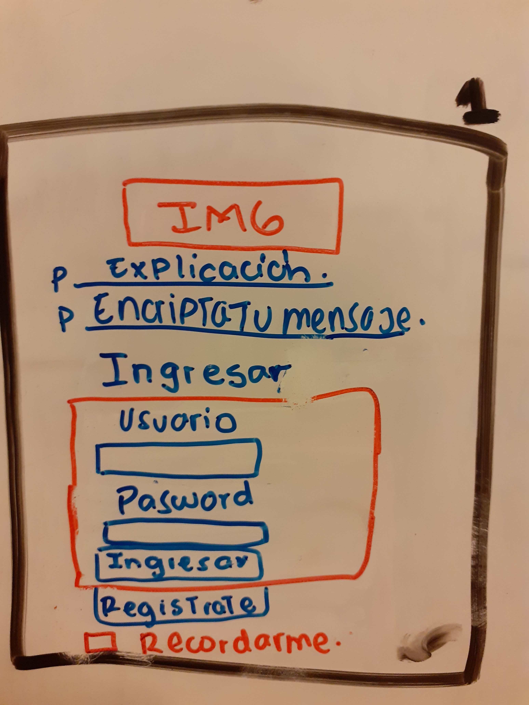
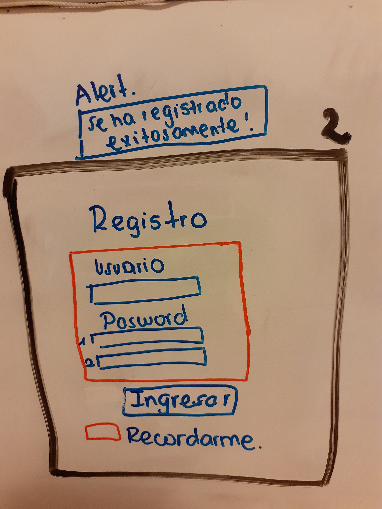
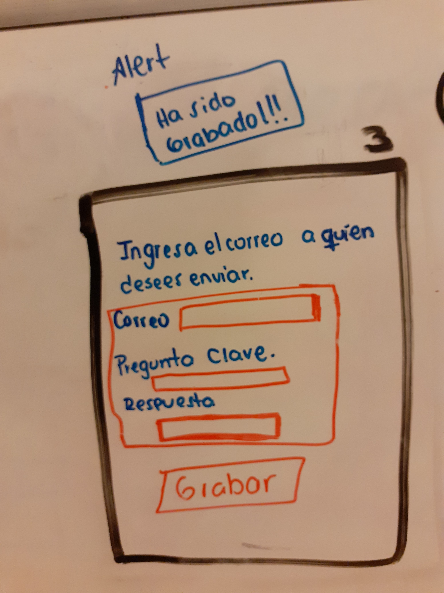
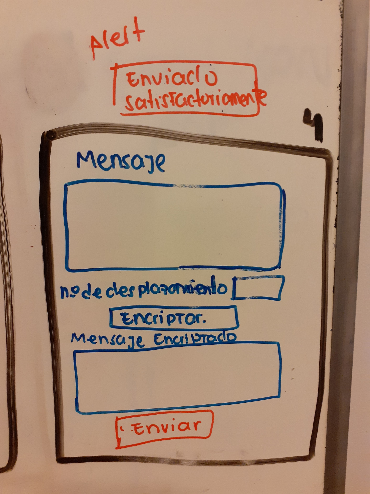
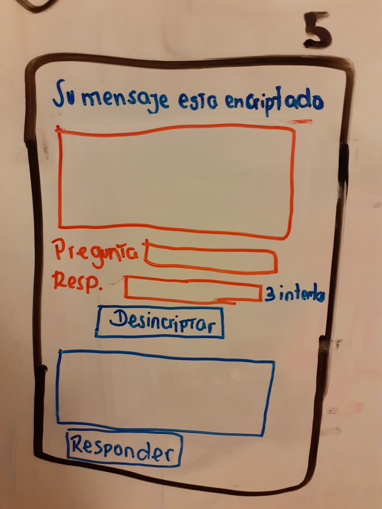
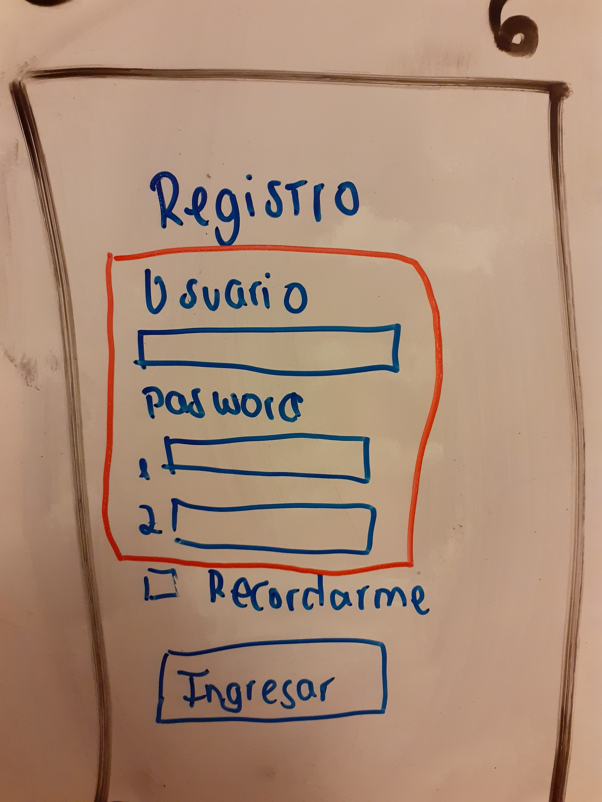
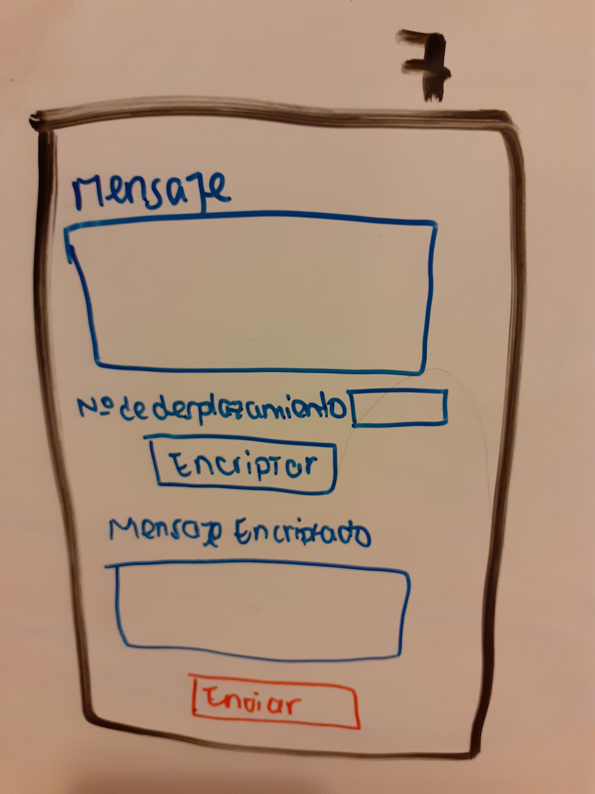
l
<h1>Investigacion UX</h1>

<h5>El usuario es una persona cuya informacion se ve comprometida y desea comunicarse de manera secreta con las personas de su confianza</h5>

<h5>CriptoNotes esta diseñada para proporcionar al usuario una manera sencilla de comunicacion encriptada.</h5>

<h2> Imagen del segundo prototipo</h2>

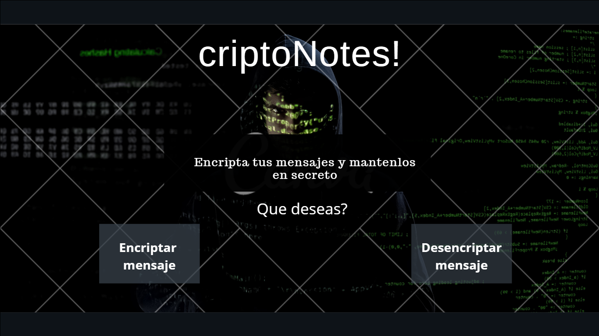

<h2> Feedback</h2>
___
Tras presentar el proyecto a los usuarios, ellos percibieron algunos detalles innecesarios en la pagina.El color de texto era muy opaco. No habia mucha informacion para los  primeros usuarios.

<h2>Ultimas Imagenes de la Página</h2>
___

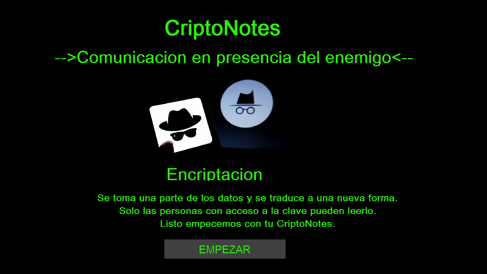

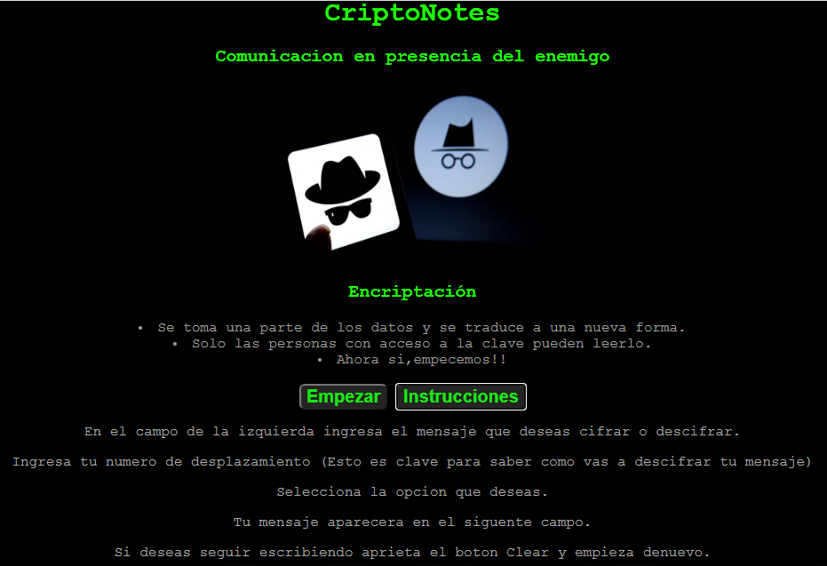

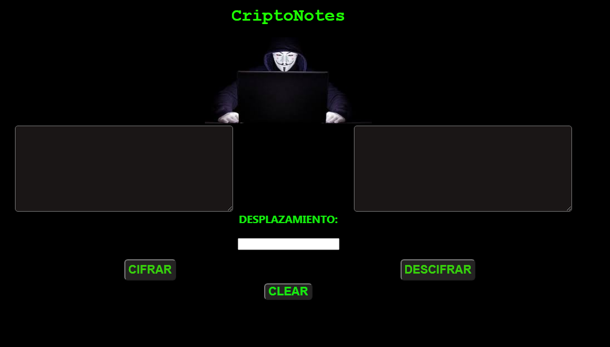
